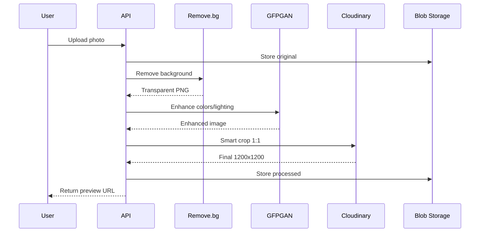
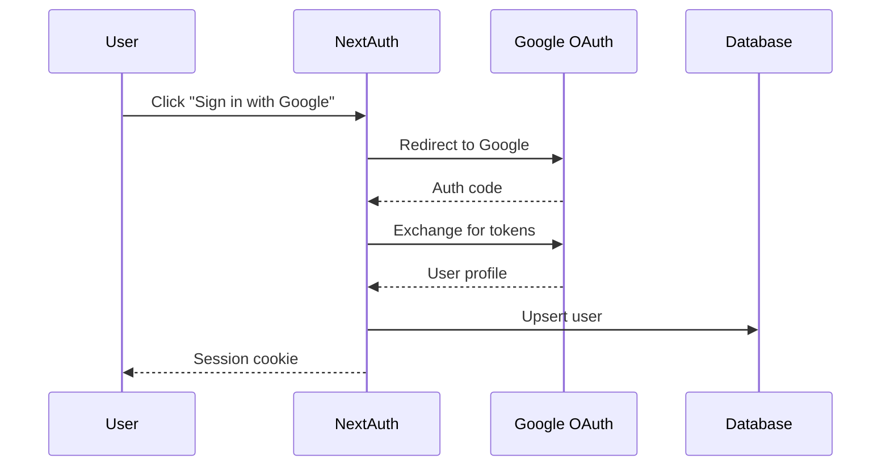
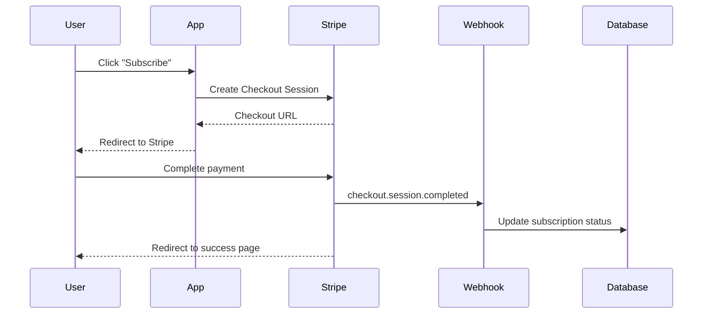

# Архитектура MVP: Blocket Photo Optimizer

## Обзор системы

```mermaid
flowchart TB
    subgraph Client["Frontend (Next.js)"]
        A[Landing Page] --> B[Upload Component]
        B --> C[Preview Gallery]
        C --> D[Download ZIP]
    end
    
    subgraph API["Next.js API Routes"]
        E[/api/upload] --> F[/api/process]
        F --> G[/api/download]
        H[/api/auth] --> I[NextAuth.js]
        J[/api/webhooks/stripe]
    end
    
    subgraph External["External Services"]
        K[Remove.bg API]
        L[Replicate GFPGAN]
        M[Cloudinary]
        N[Stripe]
    end
    
    subgraph Storage["Data Layer"]
        O[(Vercel Postgres)]
        P[(Vercel Blob)]
        Q[(Vercel KV)]
    end
    
    B --> E
    E --> P
    F --> K
    F --> L
    F --> M
    G --> P
    I --> O
    J --> O
    F --> Q
```

## Компоненты

### 1. Frontend (Next.js App Router)

| Страница | Путь | Описание |
|----------|------|----------|
| Landing | `/` | Hero, How it works, CTA |
| Upload/Editor | `/editor` | Загрузка + обработка + preview |
| Pricing | `/pricing` | Тарифы, Stripe checkout |
| Account | `/account` | Профиль, статус подписки |
| Auth | `/auth/*` | Sign in/up, magic link |

**Ключевые компоненты:**
- `<UploadZone />` — drag&drop + mobile picker
- `<PhotoCarousel />` — preview до/после
- `<ProcessingProgress />` — progress bar
- `<SubscriptionBadge />` — статус Pro/Free

### 2. Backend (API Routes)

#### `/api/upload` (POST)
```
Input: FormData с файлами (max 10, max 10MB each)
Output: { sessionId, files: [{ id, originalUrl }] }
Storage: Vercel Blob (temp, TTL 24h)
```

#### `/api/process` (POST)
```
Input: { sessionId, fileIds: [...] }
Process:
  1. Remove.bg → удаление фона
  2. Replicate GFPGAN → цветокоррекция
  3. Cloudinary → smart crop 1:1
Output: { files: [{ id, processedUrl, status }] }
Queue: Inngest для async processing
```

#### `/api/download` (GET)
```
Input: { sessionId }
Output: ZIP stream
Cleanup: mark files for deletion
```

#### `/api/webhooks/stripe` (POST)
```
Events: checkout.session.completed, customer.subscription.*
Action: update user.subscription_status in DB
```

### 3. AI Pipeline



**Fallback стратегия:**
1. Remove.bg fail → skip, use original
2. GFPGAN fail → skip, use after Remove.bg
3. Cloudinary fail → use sharp.js locally

**Стоимость за фото:**
| API | Cost | Notes |
|-----|------|-------|
| Remove.bg | $0.005 | 200 free credits/mo |
| Replicate | ~$0.01 | Pay per compute |
| Cloudinary | Free | 25GB/mo on free tier |
| **Total** | ~$0.015 | |

### 4. Data Layer

#### Vercel Postgres (Users & Subscriptions)
```sql
-- users
id, email, name, avatar, created_at

-- subscriptions
id, user_id, stripe_customer_id, stripe_subscription_id,
status (active/canceled/past_due), current_period_end

-- usage (optional, can use KV)
id, user_id, date, photos_processed
```

#### Vercel KV (Rate Limits)
```
Key: limit:{fingerprint}:{date}
Value: count (0-5)
TTL: 24h
```

#### Vercel Blob (Temp Photo Storage)
```
Path: uploads/{sessionId}/{fileId}.jpg
Path: processed/{sessionId}/{fileId}.jpg
TTL: 24h (GDPR compliance)
```

### 5. Auth Flow



**Providers:**
- Google OAuth (primary)
- Email Magic Link (fallback)

### 6. Payment Flow



### 7. Rate Limiting

**Free users:**
- 5 photos/day
- Counter in Vercel KV
- Key: IP fingerprint (FingerprintJS) or user_id

**Logic:**
```typescript
async function checkLimit(userId?: string, fingerprint?: string) {
  const key = userId || fingerprint;
  const today = new Date().toISOString().split('T')[0];
  const count = await kv.get(`limit:${key}:${today}`) || 0;
  
  if (count >= 5 && !isPro(userId)) {
    throw new Error('Daily limit reached');
  }
  
  await kv.incr(`limit:${key}:${today}`);
  await kv.expire(`limit:${key}:${today}`, 86400);
}
```

## Инфраструктура

### Vercel Configuration
```
├── Vercel Functions (API routes)
├── Vercel Edge (auth middleware)
├── Vercel Postgres
├── Vercel KV (Redis)
├── Vercel Blob Storage
└── Vercel Analytics
```

### Environment Variables
```env
# Auth
NEXTAUTH_SECRET=
GOOGLE_CLIENT_ID=
GOOGLE_CLIENT_SECRET=

# APIs
REPLICATE_API_TOKEN=
REMOVE_BG_API_KEY=
CLOUDINARY_URL=

# Stripe
STRIPE_SECRET_KEY=
STRIPE_WEBHOOK_SECRET=
NEXT_PUBLIC_STRIPE_PUBLISHABLE_KEY=

# Database
POSTGRES_URL=
KV_REST_API_URL=
KV_REST_API_TOKEN=
BLOB_READ_WRITE_TOKEN=
```

## Масштабирование (v1.1+)

| Проблема | Решение |
|----------|---------|
| API rate limits | Queue с retry (Inngest) |
| Много юзеров | Vercel auto-scaling |
| Хранилище | Retention policy 24h |
| Стоимость AI | Self-hosted models на GPU |

## Security Checklist

- [ ] HTTPS only (Vercel default)
- [ ] CORS настроен
- [ ] Rate limit на API
- [ ] Stripe webhook signature verification
- [ ] Input validation (file type, size)
- [ ] No PII in logs
- [ ] GDPR: auto-delete photos after 24h
