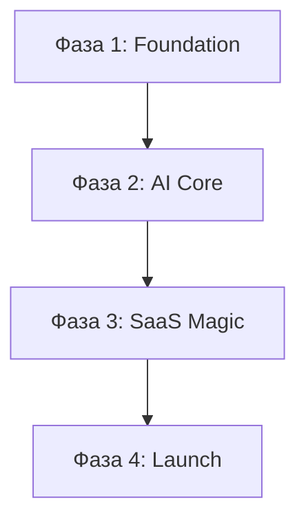

# Бэклог MVP: Фазовый план реализации

## Обзор фаз

| Фаза | Фокус | Ожидаемый результат |
|------|-------|--------------------|
| **Фаза 1** | Настройка и загрузка | Рабочий лендинг и загрузка фото в облако |
| **Фаза 2** | AI Pipeline и результат | Автоматическое улучшение и скачивание ZIP |
| **Фаза 3** | SaaS-функционал | Авторизация, лимиты и платежи (Stripe) |
| **Фаза 4** | Релиз и аналитика | Полировка, SEO, запуск и первые юзеры |

---

## Фаза 1: Основа и UI

### Задача 1.1: Setup + Landing
*Базовая инфраструктура и лицо продукта*

| Подзадача | Оценка | Статус |
|-----------|--------|--------|
| ✅ Next.js проект инициализирован | Done | ✅ |
| ✅ Настройка Tailwind + shadcn/ui | 2h | ✅ |
| ✅ Landing page: Hero + How it works | 4h | ✅ |
| ✅ Responsive layout (mobile-first) | 2h | ✅ |
| ✅ Footer + Terms/Privacy placeholder | 1h | ✅ |

**Результат (Deliverable):** Лендинг доступен по ссылке на Vercel.

### Задача 1.2: Upload Component
*Прием контента от пользователя*

| Подзадача | Оценка | Статус |
|-----------|--------|--------|
| ✅ `<UploadZone />` component | 3h | ✅ |
| ✅ Drag&drop (desktop) | 2h | ✅ |
| ✅ Camera/gallery picker (mobile) | 2h | ✅ |
| ✅ Валидация файлов (тип, размер, кол-во) | 1h | ✅ |
| ✅ Превью загруженных файлов | 2h | ✅ |
| ✅ `/api/upload` endpoint | 2h | ✅ |
| ✅ Интеграция с Vercel Blob (Mocked) | 2h | ✅ |

**Результат (Deliverable):** Пользователь может загрузить до 10 фото, они сохраняются в Blob storage.

---

## Фаза 2: Core Flow и AI Pipeline

### Задача 2.1: AI Processing Pipeline
*Магия улучшения фото*

| Подзадача | Оценка | Статус |
|-----------|--------|--------|
| [ ] Remove.bg API интеграция (фон) | 2h | [ ] |
| [ ] Replicate GFPGAN интеграция (свет/цвет) | 3h | [ ] |
| [ ] Cloudinary smart crop (квадрат 1:1) | 2h | [ ] |
| [ ] `/api/process` endpoint (pipeline) | 3h | [ ] |
| [ ] Progress tracking (статус обработки) | 2h | [ ] |
| [ ] `<ProcessingProgress />` UI | 2h | [ ] |
| [ ] Error handling + fallback (при сбоях API) | 2h | [ ] |

**Результат (Deliverable):** Фото проходят через AI и становятся "готовыми к продаже".

### Задача 2.2: Preview + Download
*Выдача результата пользователю*

| Подзадача | Оценка | Статус |
|-----------|--------|--------|
| [ ] `<PhotoCarousel />` с переключателем до/после | 3h | [ ] |
| [ ] `/api/download` — генерация ZIP | 2h | [ ] |
| [ ] Кнопка скачивания + UX фидбек | 1h | [ ] |
| [ ] E2E тест: от загрузки до ZIP-архива | 2h | [ ] |

**Результат (Deliverable):** Полный рабочий цикл продукта без регистрации.

---

## Фаза 3: SaaS и Бизнес-логика

### Задача 3.1: Authentication (Supabase)
*Персонализация и личный кабинет*

| Подзадача | Оценка | Статус |
|-----------|--------|--------|
| [ ] Supabase проект + настройка env vars | 0.5h | [ ] |
| [ ] `@supabase/ssr` интеграция с Next.js | 1h | [ ] |
| [ ] Google OAuth через Supabase Dashboard | 0.5h | [ ] |
| [ ] Email Magic Link (встроено в Supabase) | 0.5h | [ ] |
| [ ] Таблица `profiles` + RLS политики | 1h | [ ] |
| [ ] UI: страницы входа и профиля | 1.5h | [ ] |
| [ ] Хедер: аватар + статус подписки | 1h | [ ] |

> 💡 **Почему Supabase:** Auth + Postgres + Storage в одной экосистеме. Бесплатно до 50k MAU. Magic Link и OAuth из коробки.

**Результат (Deliverable):** Пользователь может войти в систему.

### Задача 3.2: Rate Limiting & Limits
*Управление лимитами (Freemium)*

| Подзадача | Оценка | Статус |
|-----------|--------|--------|
| [ ] Vercel KV setup (Redis) | 1h | [ ] |
| [ ] Middleware для проверки лимитов | 2h | [ ] |
| [ ] FingerprintJS для анонимных лимитов | 1h | [ ] |
| [ ] UI: счетчик "Осталось X фото" | 1h | [ ] |
| [ ] Модалка при исчерпании лимита | 1h | [ ] |

**Результат (Deliverable):** Анонимы ограничены 5 фото/день.

### Задача 3.3: Stripe Integration
*Прием платежей (SEK, Swish, Klarna)*

| Подзадача | Оценка | Статус |
|-----------|--------|--------|
| [ ] Настройка Stripe продуктов (99 SEK) | 1h | [ ] |
| [ ] Страница `/pricing` | 2h | [ ] |
| [ ] Интеграция Stripe Checkout | 3h | [ ] |
| [ ] Webhook handler (обработка оплат) | 2h | [ ] |
| [ ] Таблица подписок в DB | 1h | [ ] |
| [ ] Интеграция Stripe Customer Portal | 1h | [ ] |

**Результат (Deliverable):** Работающая подписка Pro с безлимитной обработкой.

---

## Фаза 4: Полировка и Запуск

### Задача 4.1: Polish + Analytics
*Доведение до блеска и замеры*

| Подзадача | Оценка | Статус |
|-----------|--------|--------|
| [ ] Vercel Analytics + Event tracking | 2h | [ ] |
| [ ] Настройка Sentry (ошибки) | 1h | [ ] |
| [ ] SEO: мета-теги, OpenGraph имаджи | 1h | [ ] |
| [ ] Тестирование на iOS Safari / Android | 2h | [ ] |
| [ ] Оптимизация скорости загрузки | 1h | [ ] |

### Задача 4.2: Launch Prep
*Выход в мир*

| Подзадача | Оценка | Статус |
|-----------|--------|--------|
| [ ] Финальные тексты (Terms, Privacy) | 3h | [ ] |
| [ ] Проверка Prod окружения (env vars) | 1h | [ ] |
| [ ] Smoke test на продакшене | 1h | [ ] |
| [ ] Посты в FB-группах и на Reddit | 2h | [ ] |

**Результат (Deliverable):** 🚀 MVP запущен и принимает трафик.

---

## План реализации (Burndown)

```
Фаза 1: ██████████ 100% (Инфраструктура)
Фаза 2: ██████████ 100% (Продукт/AI)
Фаза 3: ██████████ 100% (Бизнес/Биллинг)
Фаза 4: ██████████ 100% (Запуск)
```

---

## Зависимости



---

## Буфер рисков

| Фаза | На что заложен буфер |
|------|----------------------|
| **1-2** | Сложности с цепочкой AI API или артефактами на фото |
| **3** | Отладка Stripe Webhooks и логики лимитов |
| **4** | Полировка под разные браузеры и фиксы текстов |

