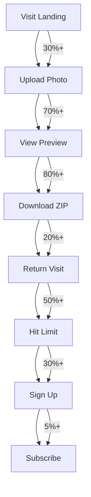

# Метрики и План Валидации

## North Star Metric

| Метрика | Определение | Таргет M1 |
|---------|-------------|-----------|
| **Weekly Processed Photos** | Кол-во успешно обработанных фото за неделю | 500+ |

**Почему**: напрямую связана с ценностью (юзер получает готовые фото) и revenue (больше фото → выше вероятность конверсии в paid).

---

## Вспомогательные метрики

### Acquisition (привлечение)

| Метрика | Описание | Таргет M1 |
|---------|----------|-----------|
| **Visitors** | Уникальные посетители/неделя | 500+ |
| **Sign-ups** | Регистрации/неделя | 50+ |
| **Conversion: Visit → Upload** | % посетителей загрузивших фото | >30% |

### Activation (активация)

| Метрика | Описание | Таргет M1 |
|---------|----------|-----------|
| **Conversion: Upload → Download** | % начавших, скачавших результат | >70% |
| **Time to Value** | Секунды от загрузки до скачивания | <60 сек |
| **Photos per Session** | Среднее кол-во фото за визит | 3+ |

### Retention (возврат)

| Метрика | Описание | Таргет M1 |
|---------|----------|-----------|
| **DAU/MAU** | Соотношение дневных/месячных юзеров | >15% |
| **Week 1 Retention** | % вернувшихся через 7 дней | >20% |
| **Repeat Usage** | % использующих 2+ раз | >30% |

### Revenue (доход)

| Метрика | Описание | Таргет M1 |
|---------|----------|-----------|
| **Conversion: Free → Paid** | % подписавшихся из зарегистрированных | >5% |
| **MRR** | Monthly Recurring Revenue | 990+ SEK (~10 подписок) |
| **ARPU** | Средний доход на юзера | 10+ SEK |

### Technical (техника)

| Метрика | Описание | Таргет |
|---------|----------|--------|
| **Processing Time** | Время обработки 1 фото | <15 сек (p95) |
| **Error Rate** | % неудачных обработок | <5% |
| **Uptime** | Доступность сервиса | >99% |

---

## Tracking Implementation

### Vercel Analytics (базовый)
- Page views
- Core Web Vitals
- Top pages

### Custom Events (через Vercel Analytics или Mixpanel)

```typescript
// Events to track
const EVENTS = {
  // Acquisition
  'page_view': { page: string },
  'signup_started': { method: 'google' | 'email' },
  'signup_completed': { method: 'google' | 'email' },
  
  // Activation
  'photo_upload_started': { count: number },
  'photo_upload_completed': { count: number },
  'processing_started': { count: number },
  'processing_completed': { count: number, duration_ms: number },
  'processing_failed': { error: string },
  'preview_viewed': {},
  'download_started': { count: number },
  'download_completed': { count: number },
  
  // Revenue
  'pricing_viewed': {},
  'checkout_started': {},
  'subscription_completed': { plan: string },
  'subscription_cancelled': {},
  
  // Engagement
  'limit_reached': { type: 'daily' | 'anonymous' },
};
```

---

## Воронка (Funnel)



---

## План валидации спроса

### Fase 1: Pre-Launch (до MVP)

| Действие | Timing | Метрика успеха |
|----------|--------|----------------|
| Пост в FB-группе "Blocket tips" | День -7 | >50 заинтересованных |
| Landing page с waitlist | День -5 | >100 email подписок |
| Опрос potential users | День -3 | >20 ответов, >60% "хочу" |

### Fase 2: Soft Launch (неделя 1)

| Действие | Timing | Метрика успеха |
|----------|--------|----------------|
| Invite первых 50 юзеров | День 1-3 | >30 активных |
| Собрать feedback | День 3-7 | NPS >30 |
| Итерация по UX | День 5-7 | Error rate <10% |

### Fase 3: Public Launch (неделя 2+)

| Действие | Timing | Метрика успеха |
|----------|--------|----------------|
| Пост в r/sweden, Flashback | День 8 | >200 visitors/day |
| Первые платящие | День 8-14 | >5 подписок |
| Product Hunt launch | День 14+ | >100 upvotes |

---

## Dashboard MVP

### Minimal Dashboard (Vercel Analytics + KV)

```
┌─────────────────────────────────────────────────┐
│  BLOCKET PHOTO OPTIMIZER - Dashboard            │
├─────────────────────────────────────────────────┤
│                                                 │
│  TODAY          THIS WEEK        THIS MONTH    │
│  ┌────────┐     ┌────────┐      ┌────────┐     │
│  │   42   │     │  284   │      │  1.2K  │     │
│  │ photos │     │ photos │      │ photos │     │
│  └────────┘     └────────┘      └────────┘     │
│                                                 │
│  USERS                          REVENUE         │
│  ┌────────────────────┐        ┌──────────┐    │
│  │ Total: 156         │        │ MRR:     │    │
│  │ Pro: 12 (7.7%)     │        │ 1,188 SEK│    │
│  │ Active today: 28   │        └──────────┘    │
│  └────────────────────┘                        │
│                                                 │
│  CONVERSION FUNNEL                              │
│  Visit → Upload: 34%                            │
│  Upload → Download: 78%                         │
│  Free → Paid: 7.7%                              │
│                                                 │
└─────────────────────────────────────────────────┘
```

---

## Сигналы для Product-Market Fit

### 🟢 Зелёный свет (продолжаем)
- Free → Paid conversion >5%
- Week 1 retention >20%
- NPS >30
- Organic word-of-mouth (users invite friends)

### 🟡 Жёлтый свет (пивотим)
- Conversion 2-5%
- Retention 10-20%
- Много "nice, but..." feedback

### 🔴 Красный свет (останавливаем)
- Conversion <2%
- Retention <10%
- High churn from paid
- Negative feedback на качество

---

## Еженедельный Review

Каждую пятницу:
1. Посмотреть метрики
2. Прочитать feedback (email, support)
3. Приоритизировать топ-3 проблемы
4. Обновить бэклог
